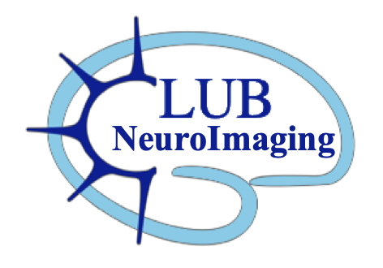

[Accueil](index.md) · [Next meetings](next-meetings.md) · [Old meetings](old-meetings.md) · [Ressources](ressources.md)

---

# Old meetings

Liste des réunions passées et présentations associées (PDF / PPT téléchargeables).

- **26/09/26** — c'est la rentrée — [PDF](presentations/2026_09_club_NeuImg_65_v1.pdf)
- **JJ/MM/AA** — titre — [PDF](presentations/nom-du-fichier.pdf) / [PPTX](presentations/nom-du-fichier.pptx)

older meetings : lien vers OSF
even older : lean vers wiki CRNL 

Pour ajouter une présentation : déposez le fichier dans le dossier `presentations/`, puis ajoutez une ligne ci-dessus avec un lien relatif vers ce fichier.
